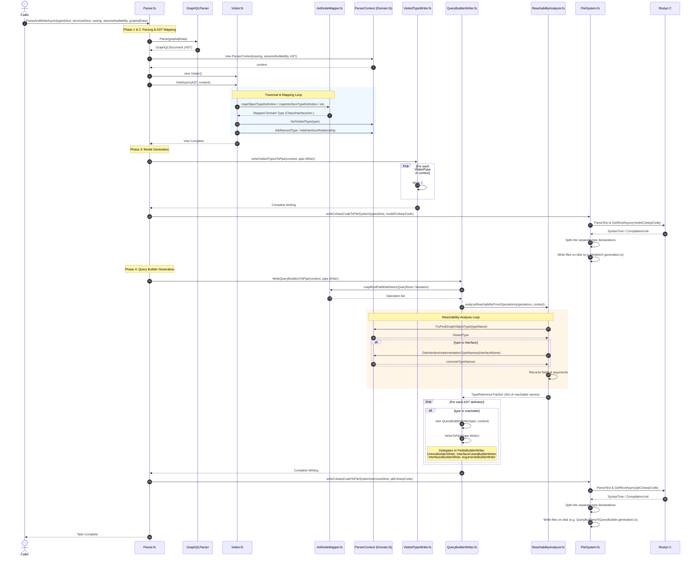

# ShopifySharp GraphQL Parser Architecture & Pipeline

This document details how the [ShopifySharp.GraphQL.Parser](../ShopifySharp.GraphQL.Parser) project parses Shopify's GraphQL schema definition (SDL) file, processes its AST, performs a reachability analysis, and generates C# classes and fluent query/operation builders. Since the parser is written in <a href="https://fsharpforfunandprofit.com/?utm_source=shopifysharp&utm_medium=web&utm_campaign=unsolicited_traffic&utm_content=external_link">my favorite language, F#</a>, I've documented how it works here and will make an effort to keep this document up-to-date.

---

## End-to-End Pipeline Diagram

Here's a fancy pants Mermaid diagram which shows the parser's execution flow, from the GraphQL schema file input all the way to the generated C# files:

```mermaid
graph TD
    %% Define Styles
    classDef input fill:#e1f5fe,stroke:#0288d1,stroke-width:2px;
    classDef parsing fill:#f3e5f5,stroke:#7b1fa2,stroke-width:2px;
    classDef context fill:#e8f5e9,stroke:#2e7d32,stroke-width:2px;
    classDef analysis fill:#fff8e1,stroke:#fbc02d,stroke-width:2px;
    classDef codegen fill:#ffebee,stroke:#c62828,stroke-width:2px;
    classDef output fill:#eceff1,stroke:#37474f,stroke-width:2px;

    %% Nodes
    subgraph Input ["1. Input Phase"]
        Schema["GraphQL Schema File (graphqlData)"]
        ParserEntry["Parser.fs (ParseAndWriteAsync)"]
    end
    class Schema,ParserEntry input;

    subgraph ASTParsing ["2. AST Parsing & Mapping"]
        GLParser["GraphQLParser (Parser.Parse)"]
        AST["GraphQLDocument (AST)"]
        Visitor["Visitor.fs (Visitor)"]
        Mapper["AstNodeMapper.fs"]
    end
    class GLParser,AST,Visitor,Mapper parsing;

    subgraph Store ["3. Parser Context Store"]
        Ctx["ParserContext (Domain.fs)"]
        subgraph DomainModels ["Parsed Domain Types"]
            Class["Class (C# record)"]
            Interface["Interface (I-prefixed interface)"]
            Enum["VisitedEnum (C# enum)"]
            InputObj["InputObject (GraphQLInputObject<T>)"]
            Union["UnionType (IGraphQLUnionType)"]
            Op["Operation (GraphQL operations)"]
        end
    end
    class Ctx,DomainModels,Class,Interface,Enum,InputObj,Union,Op context;

    subgraph Reachability ["4. Reachability Analysis"]
        RA["ReachabilityAnalyzer.fs"]
        OpsCollect["Collect root fields from QueryRoot & Mutation"]
        Tracker["TypeReferenceTracker (Set of reachable type names)"]
    end
    class RA,OpsCollect,Tracker analysis;

    subgraph CodeGen ["5. Code Generation (Writers)"]
        subgraph ModelGen ["Model Generator"]
            VTW["VisitedTypeWriter.fs"]
            ModelPipe["Model Code PipeWriter"]
        end

        subgraph QBGen ["Query Builder Generator"]
            QBW["QueryBuilderWriter.fs"]
            FBW["FieldsBuilderWriter.fs"]
            UBW["UnionsBuilderWriter.fs"]
            UCBW["UnionCasesBuilderWriter.fs"]
            ICBW["InterfaceCasesBuilderWriter.fs"]
            ICWs["InterfacesBuilderWriter.fs"]
            ABW["ArgumentsBuilderWriter.fs"]
            QBPipe["Query Builder Code PipeWriter"]
        end
    end
    class ModelGen,QBGen,VTW,ModelPipe,QBW,FBW,UBW,UCBW,ICBW,ICWs,ABW,QBPipe codegen;

    subgraph FileSystemWrite ["6. Roslyn Splitting & File IO"]
        FS["FileSystem.fs"]
        Roslyn["Roslyn CSharpSyntaxTree Parser"]
        Files["Individual .generated.cs files on disk"]
    end
    class FileSystemWrite,FS,Roslyn,Files output;

    %% Connections
    Schema --> ParserEntry
    ParserEntry -->|Invokes| GLParser
    GLParser -->|Produces| AST
    ParserEntry -->|Creates| Ctx
    ParserEntry -->|Runs Visitor on AST| Visitor

    Visitor -->|Dispatches Node Types| Mapper
    Mapper -->|Maps to| DomainModels
    DomainModels -->|Stored in| Ctx

    %% Reachability
    QBW -->|1. Collect root fields| OpsCollect
    OpsCollect -->|2. Pass to analyzer| RA
    RA -->|3. Recurse field & argument types| Tracker
    Tracker -->|4. Filters reachable types| QBW

    %% Generation Pipeline
    Ctx -->|Read VisitedTypes| VTW
    Ctx -->|Read VisitedTypes| QBW

    VTW -->|Writes models| ModelPipe

    QBW -->|Writes Query & Operation builders| QBPipe
    QBW -->|Delegates fields| FBW
    QBW -->|Delegates unions| UBW
    QBW -->|Delegates interfaces| ICWs
    UBW -->|Creates| UCBW
    ICWs -->|Creates| ICBW
    QBW -->|Delegates arguments| ABW

    FBW -->|Writes field methods| QBPipe
    UCBW -->|Writes fragment methods (OnX)| QBPipe
    ICBW -->|Writes fragment methods (OnX)| QBPipe
    ABW -->|Writes arguments methods| QBPipe

    ModelPipe -->|unified C# string| FS
    QBPipe -->|unified C# string| FS

    FS -->|Parse compilation unit| Roslyn
    Roslyn -->|Split by TypeDeclaration| FS
    FS -->|Write files with appropriate subdirs| Files
```

## Architectural Sequence Diagram

This sequence diagram details the parser's step-by-step execution flow and interactions of individual component pieces during the schema parsing and code generation process:



---

## Walkthrough of the Processing Pipeline

This is a mid-level overview of what the Parser project is doing.

> [!WARNING]
> This is liable to change at any given time, as I'm not quite satisfied with the Parser project's spaghetti-adjacent architecture and may get a wild hair in the future to refactor it.

### Phase 1 & 2: Parsing & AST Mapping

1. **Entrypoint**: `Parser.ParseAndWriteAsync` receives the raw GraphQL schema document.
2. **Lexing/Parsing**: It uses a third-party package, `GraphQLParser.Parser`, to parse and construct a `GraphQLDocument` AST representing the entire schema.
3. **AST Traversal**: A custom `Visitor` (derived from `ASTVisitor<ParserContext>`) walks the AST nodes.
4. **Node Mapping**: For each object, interface, enum, input (as in, graphql argument input types) or union definition, the `Visitor` calls [AstNodeMapper.fs](../ShopifySharp.GraphQL.Parser/AstNodeMapper.fs):
   - Maps `GraphQLObjectTypeDefinition` to `Class`.
   - Maps `GraphQLInterfaceTypeDefinition` to `Interface`.
   - Maps `GraphQLEnumTypeDefinition` to `VisitedEnum`.
   - Maps `GraphQLInputObjectTypeDefinition` to `InputObject`.
   - Maps `GraphQLUnionTypeDefinition` to `UnionType`.
5. **Context Aggregation**: The mapped structures are registered and saved inside a map in the [ParserContext](../ShopifySharp.GraphQL.Parser/Domain.fs) for lookups during code generation.

### Phase 3: Reachability Analysis

To prevent generating query builders for unreachable types (which results in excessive dead code in the final C# output – Shopify publishes a lot of dead code in their schema for some reason), the parser runs the [ReachabilityAnalyzer](../ShopifySharp.GraphQL.Parser/ReachabilityAnalyzer.fs). This analyzer does the following:

1. It collects all root operations from `QueryRoot` and `Mutation`.
2. Starting from these operations, it recursively drills down through the schema to discover all referenced return types, argument types, interfaces, interface implementations, and union cases. If a GraphQL interface is reachable, all of its concrete implementations are also marked as reachable, since fields returning an interface can resolve to any of those implementations at runtime.
3. It keeps a `TypeReferenceTracker` (a set of reachable type names) to act as a filter for which types should actually be generated when we get to the next phase.

### Phase 4: Code Generation

Two parallel tasks run, each generating code:

1. **Model Generation (`VisitedTypeWriter.fs`)**:
   - Generates C# `record`, `interface` and `enum` representations of the GraphQL types. These are the C# model representations of all reachable GraphQL types in Shopify's schema.
   - Attaches serialization attributes (e.g. `[JsonPropertyName]`, `[JsonPolymorphic]` and polymorphic `[JsonDerivedType]` markers for interfaces) to those generated C# models, which helps ShopifySharp deserialize them at runtime.
2. **Query Builder Generation (`QueryBuilderWriter.fs`)**:
   - This is responsible for generating the fluent query builders and operation query builders.
    - [FieldsBuilderWriter.fs](../ShopifySharp.GraphQL.Parser/FieldsBuilderWriter.fs) writes query builder methods for adding fields to a query.
    - [ArgumentsBuilderWriter.fs](../ShopifySharp.GraphQL.Parser/ArgumentsBuilderWriter.fs) writes separate nested `ArgumentsBuilder` classes for queries or fields with arguments (e.g. `Arguments.First(10)`).
    - [UnionsBuilderWriter.fs](../ShopifySharp.GraphQL.Parser/UnionsBuilderWriter.fs) and [UnionCasesBuilderWriter.fs](../ShopifySharp.GraphQL.Parser/UnionCasesBuilderWriter.fs) write the `.OnSomeUnionType(Action<ConcreteTypeQueryBuilder> build)` inline fragment selection methods for union types.
    - [InterfacesBuilderWriter.fs](../ShopifySharp.GraphQL.Parser/InterfacesBuilderWriter.fs) and [InterfaceCasesBuilderWriter.fs](../ShopifySharp.GraphQL.Parser/InterfaceCasesBuilderWriter.fs) write the `.OnSomeConcreteType(Action<ConcreteTypeQueryBuilder> build)` inline fragment selection methods for interface types.

### Phase 5: Roslyn Splitting & File writing

Rather than having the writers deal with individual file writes, both of the writers from the previous phase output to a unified pipe. The [FileSystem.fs](../ShopifySharp.GraphQL.Parser/FileSystem.fs) module splits and parses the output like so:

1. The entire output is parsed using **Roslyn's `CSharpSyntaxTree`** API.
2. The module extracts all root `BaseTypeDeclarationSyntax` items (each class, record, interface or enum).
3. It creates a new `CompilationUnit` for each individual type, carrying over the namespace definition and top-level using directives.
4. It looks at the namespaces for each generated type and maps the namespace suffix to subdirectories on disk (e.g. query builders with `.QueryBuilders.Operations` are placed under `QueryBuilders/Operations/`, and types go under `QueryBuilders/Types/`).
5. Finally, it writes each type to its own `.generated.cs` file in the appropriate subdirectory.

## Feedback

That's it! If you've got any questions or suggestions about this marvelous Rube Goldberg machine I've set up to parse a simple GraphQL schema file and output C#, let me know!
