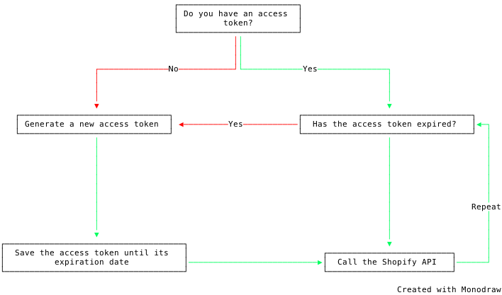

import { Aside } from "@astrojs/starlight/components";

<Aside type="tip">
This page covers a topic that's exclusive to **custom** Shopify apps, which are Shopify apps that are locked to a single Shopify store. If you're developing a public Shopify app (i.e. one that's published on the Shopify App Store, and one that can be installed on multiple stores), you should read [OAuth integration, authorization and request authentication](/getting-started/authentication-and-authorization) instead.
</Aside>

In days gone by, developers of Custom Shopify Apps (what we used to call "private" Shopify apps) would generate an API key and a "password" to use with Shopify's API. This password was, for all intents and purposes, an API access token; it could be used anywhere the Shopify API, and ShopifySharp itself, expected an access token. It had no expiration, was often stored in a config file instead of a database or secret manager, and was usually logged at least once in an email, Slack or Teams message.

Custom apps worked this way for years, and we app developers gleefully marveled at our all-powerful access tokens. But at the same time, a creeping thought was haunting the dreams of Shopify's API devs: "What about the logs," it asked, "what if they leak with a custom app's password inside?"

The fear was that, if a custom app were to accidentally log or leak their password, both the app *and the shop* would be compromised. An attacker would be able to read data directly from the shop using Shopify's API, and it'd look like it came from your app to boot.

In early 2026, Shopify's API devs ~~let their intrusive thoughts win~~ decided the convenience was no longer worth the risk: custom Shopify apps could no longer use the "password" as an access token. This instantly mitigated a swathe of potential leaks, and introduced a tiny bit of tedium for us app developers: instead of an ageless token, custom apps must use their credentials to generate a "client credentials" access token, which is a *temporary* grant authorizing your application to make requests to the Shopify API **for 24 hours** before it expires. After those 24 hours are up, the token expires and can't be used again, and your app needs to generate a new one.



This process is pretty similar to what public apps are required to do with their Expiring Offline Access Tokens. And while it can sometimes chafe to have new, tedious rituals introduced (especially ones with arbitrary time limits) where things were ostensibly working just fine before, it ultimately makes our apps and our users more secure.

## Generating an access token

Enough finger flappin', let's talk about using ShopifySharp to generate one of these "client credential" access tokens, and then we'll go over how you can check if the token has expired, and how to regenerate it.

To begin, you'll need your custom app's **Client Id** and **Client Secret**, along with your store's \*.myshopify.com domain. You'll use these to instantiate a new `ClientCredentialsAccessTokenOptions` object, and pass that to the `ShopifyOauthUtility.GetClientCredentialsAccessTokenAsync` method:

```cs
var oauthUtility = new ShopifyOauthUtility();
var authResult = await oauthUtility.GetClientCredentialsAccessTokenAsync(new ClientCredentialsAccessTokenOptions
{
    ClientId = "YourClientId",
    ClientSecret = "YourClientSecret_PleaseDontAddThisToGit",
    ShopDomain = "example.myshopify.com"
});
```

The return value here is a `ShopifySharp.AuthorizationResult`, which contains your freshly minted access token, along with a timestamp indicating when the timestamp will expire. Take that access token and pass it to any of ShopifySharp's services to authenticate your app with Shopify's API:

```cs
var accessToken = authResult.AccessToken;
var expiresIn = authResult.ExpiresIn;
var expiresAt = authResult.AccessTokenExpiresAtUtc;

// Make a call to the GraphQL API using the new token
var credentials = new ShopifyApiCredentials("example.myshopify.com", accessToken);
var service = new GraphService(credentials);

var shop = await service.PostAsync("query { shop { id } }");
```

Easy peasy. You'll want to store the access token and its expiration timestamp in some kind of cache or database, and keep reusing it until it expires. Doing this will avoid situations where your app is accidentally doubling up on HTTP calls sent to Shopify by generating a new access token for each request. How you store these items is going to come down to the specifics of your own app and infrastructure, and thus beyond the scope of this guide.

<Aside type="tip">
As I write this documentation, it dawns on me that it's a bit odd to have methods for Custom Apps contained within the ShopifyOauthUtility class, when Custom Apps are locked to one store and can't use OAuth. I'd like to publish an informal apology for the casualties of my late night coding sessions, and mildly regret the inconsistency!
</Aside>

## Check if a token has expired and regenerate it

These client credential tokens only last for a mere 24 hours, after which **you need to generate a brand new token**. To be perfectly clear: unlike public apps, which are issued refresh tokens alongside their temporary access tokens, custom apps do *not* refresh their access tokens; they aren't issued a refresh token at all. Instead, custom apps just generate a new client credential access token using the same API call (and thus the same ShopifySharp method) that was used to generate the original token:

```cs
// For custom apps, creating a new access token is the same thing as "refreshing" an expired access token
var authResult = await oauthUtility.GetClientCredentialsAccessTokenAsync(new ClientCredentialsAccessTokenOptions
{
    ClientId = "YourClientId",
    ClientSecret = "YourClientSecret_PleaseDontAddThisToGit",
    ShopDomain = "example.myshopify.com"
});
var accessToken = authResult.AccessToken;
var expiresAt = authResult.AccessTokenExpiresAtUtc;
```

If you try to use an access token after it expires, Shopify will return a 429 Forbidden error, which in turn causes ShopifySharp to throw a `ShopifyHttpException`. You'll need to guard against expired tokens and their subsequent exceptions, which you can do in one of two different ways: catch the exception, or proactively check if the token's expiration timestamp has elapsed.

If you want to catch the exception that's thrown when an access token expires and returns a 429 Forbidden error, you can do so like this:

```cs
try
{
    var result = await graphService.PostAsync("...");
}
catch (ShopifyException ex) when (ex.HttpStatusCode == HttpStatusCode.Forbidden)
{
    // Token has expired, create a new token here
}
```

Or, if you'd rather be proactive and check the token's expiration timestamp, just compare the `AccessTokenExpiresAtUtc` value to `DateTimeOffset.UtcNow`:

```cs
if (DateTimeOffset.UtcNow >= authResult.AccessTokenExpiresAtUtc)
{
    // Token has expired, create a new token here
}
```

ShopifySharp's `ShopifyOauthUtility` class includes a convenience method which will do that expiration check for you, and then automatically generate a new token if it's expired. You just need to pass in the expiration timestamp (the `AccessTokenExpiresAtUtc` property from the `AuthorizationResult` you got back when creating the access token), along with the usual client ID, secret and shop domain.

This convenience method will return a new `AuthorizationResult` if your token is refreshed, or it will return `null` if it wasn't refreshed (i.e. the timestamp doesn't indicate the token has expired yet):

```cs
var options = new ClientCredentialsAccessTokenIfStaleOptions
{
    ClientId = options.ClientId,
    ClientSecret = options.ClientSecret,
    ShopDomain = "example.myshopify.com",
    AccessTokenExpiresAtUtc = existingToken.AccessTokenExpiresAtUtc,
};
string accessToken;
DateTimeOffset expiresAt;

// Recreate the token if it's expired
AuthorizationResult? recreateResult = await shopifyOauthUtility.GetClientCredentialsAccessTokenIfStaleAsync(options);

if (recreateResult is not null)
{
    // Token was recreateed, save the new access token and expiration timestamp for the next 24 hours
    accessToken = recreateResult.AccessToken;
    expiresAt = recreateResult.AccessTokenExpiresAtUtc;
}
else
{
    // Token was not recreateed, continue using the existing token
    accessToken = existingToken.AccessToken;
    expiresAt = existingToken.AccessTokenExpiresAtUtc;
}
```

By default, the method will only refresh the token if the expiration has passed, but you can control whether it should be refreshed before that (and how soon before that) by setting the `RefreshBeforeExpiry` property. For example, if you want ShopifySharp to refresh the token at any point within 5 minutes of its expiry, you'd set a timespan with a length of 5 minutes:

```diff lang="cs"
 var options = new ClientCredentialsAccessTokenIfStaleOptions
 {
     ClientId = options.ClientId,
     ClientSecret = options.ClientSecret,
     ShopDomain = "example.myshopify.com",
     AccessTokenExpiresAtUtc = existingToken.ExpiresAt,
+    RefreshBeforeExpiry = TimeSpan.FromMinutes(5),
 };
```

At the moment, ShopifySharp doesn't have any built-in [Request Execution Policy](/getting-started/request-execution-policy/) which can automatically call the token creation endpoint when the token has expired. I'm actively exploring how such a policy would work, however, and would love to eventually add one to ShopifySharp. Stay tuned!
