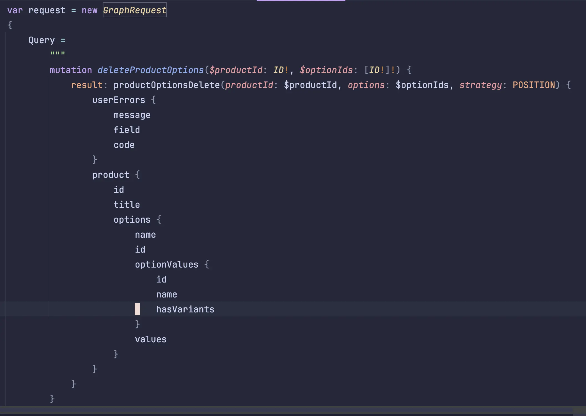
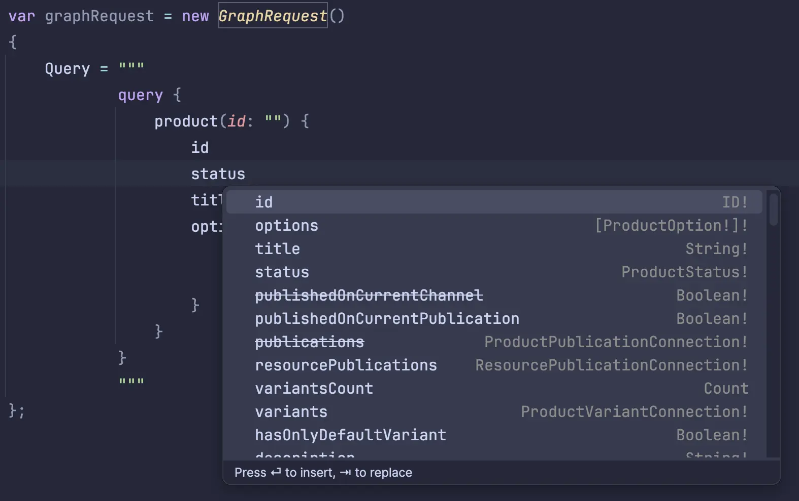

import { Aside } from '@astrojs/starlight/components'
import OutboundLink from '../../../components/OutboundLink.astro';


Shopify's GraphQL API is fully supported in ShopifySharp via the `GraphService` and `GraphServiceFactory` classes. Using these classes, you'll be able to write custom graph queries which can return multiple objects in the same call; or write mutation operations that e.g. fulfill an order, archive it, and update the customer's notes all in the same request.

## Optional step: IDE configuration and schema file

Before you start using the GraphService, you may want to take a moment to configure your IDE for a better GraphQL developer experience. Specifically, check if your IDE supports <OutboundLink href="https://steven-giesel.com/blogPost/d2b2fc18-ca4c-4879-b87f-a1d36f435805?utm_source=shopifysharp">.NET's `StringSyntax` attribute</OutboundLink>, which ShopifySharp uses to automatically add GraphQL syntax highlighting when you write graph queries in the `GraphRequest.Query` string property:



If you're using Rider, Visual Studio or Visual Studio Code, the `StringSyntax` feature *should* be supported by default

<Aside type="note">
The `StringSyntax` feature is only available for projects that target .NET 6 or newer.
</Aside>

import { FileTree } from '@astrojs/starlight/components';

Next, you'll want to download the latest <OutboundLink href="https://github.com/nozzlegear/ShopifySharp/blob/master/graphql.schema.json">graphql.schema.json</OutboundLink> and <OutboundLink href="https://github.com/nozzlegear/ShopifySharp/blob/master/graphql.config.yml">graphql.config.yml</OutboundLink> files from this repository. Place those two files in your solution's root directory.

<FileTree>
- YourDotnetSolution/
    - ...
    - **graphql.config.yml**
    - **graphql.schema.json**
    - ...
    - src/
      - YourDotnetProject/
    - tests/
      - YourDotnetProject.Tests/
    - YourSolution.slnx
</FileTree>

<Aside type="note">
The **graphql.schema.json** file must be updated each time ShopifySharp updates to target a new version of Shopify's GraphQL API. The current API version is tracked on the project's front page, but right now I'm not aware of a great way to let developers know when ShopifySharp begins targeting a new Shopify API version and thus it's time to update the schema file. Let me know if you have suggestions!
</Aside>
Finally, depending on your IDE, you may need to install a GraphQL plugin. If necessary, configure the plugin to find the **graphql.config.yml** file you downloaded from this repository. Once you've got the plugin installed and configured, you should find that you now have full intellisense and autocomplete for all of your Shopify GraphQL queries/mutations written with ShopifySharp. You can confirm this by instantiating a new `ShopifySharp.GraphRequest` and then typing a GraphQL query in the `Query` property:



## Writing a query or mutation

<Aside type="note">
I have plans to improve the query and mutation building experience as soon as possible. These plans include a fluent-style query builder, a source generator for generating clients with predefined queries and mutations, and more. [See below for more details.](#planned-improvements)
</Aside>

Writing a GraphQL query or mutation with ShopifySharp's GraphService starts with the `GraphRequest` class. Right now, all graph query text must be passed to this class's `Query` property, which means you'll either need to type it by hand in your IDE – an experience that should be much improved thanks to the `StringSyntax` attribute and your IDE's GraphQL plugin – or loading the query text from disk, stream, etc.

This example uses the `products` query to list the first 3 products with a status of `ACTIVE` (meaning they're published on the storefront):

```cs
var request = new GraphRequest
{
    Query =
        """
        query {
            products(first: 3, query: "status:ACTIVE") {
                pageInfo {
                    startCursor
                    endCursor
                    hasNextPage
                    hasPreviousPage
                }
                nodes {
                    id
                    # Get the product's REST Id too
                    legacyResourceId
                    title
                    handle
                    hasOnlyDefaultVariant
                    variantsCount {
                        count
                    }
                }
            }
        }
        """
}
```

You can <OutboundLink href="https://shopify.dev/docs/api/admin-graphql/2024-10/queries/products">refer to Shopify's GraphQL documentation</OutboundLink> for the full list of available queries and mutations, or you can use the intellisense and autocompletion provided by your IDE's GraphQL plugin to explore the schema directly.

<Aside type="note">
Tip: Use your IDE's "Go to Definition" when you're writing a GraphQL query! If you've configured the plugin and schema files outlined above, your IDE will show you the full definition of a Shopify graph type or operation – just like C#!
</Aside>

### Variables

To add variables to your query or mutation, use the `GraphRequest.Variables` dictionary, and then refer to them by key in your graph query:

```cs
var request = new GraphRequest
{
    Query =
        """
        query listProducts($limit: Int!, $query: String!) {
            products(first: $limit, query: $query) {
                pageInfo {
                    startCursor
                    endCursor
                    hasNextPage
                    hasPreviousPage
                }
                nodes {
                    id
                    # Get the product's REST Id too
                    legacyResourceId
                    title
                    handle
                    hasOnlyDefaultVariant
                    variantsCount {
                        count
                    }
                }
            }
        }
        """,
    Variables = new Dictionary<string, object>
    {
        {"limit", 3},
        {"query", "status:" + ProductStatus.ACTIVE}
    }
}
```

In general, you **should not use string interpolation** to interpolate variables you receive from your users into the graph query itself – think of it like SQL injection, you never want to inject unsanitized user data into your queries. This is what the variables dictionary is for!

## Sending the request

To send your request to Shopify, you just need to pass it to one of the `GraphService.PostAsync` methods. There are three of them available, each with a slightly different return type:

### `Task<GraphResult<T>> GraphResponse<T> GraphService.PostAsync<T>(GraphRequest graphRequest, CancellationToken cancellationToken)`

This is the easiest method to use, as it will automatically deserialize the response from Shopify into your desired data type `T`. Once the task is unwrapped, the returned `GraphResult<T>` will have the following properties:

| Name | Type | Description |
| ---- | ---- | ----------- |
| `RequestId` | `string?` | The `X-Request-Id` header returned by Shopify. This can be used when working with the Shopify support team to identify the failed request. |
|| `Extensions` | <OutboundLink href="https://github.com/nozzlegear/shopifysharp/blob/master/ShopifySharp/Services/Graph/GraphExtensions.cs"><code>GraphExtensions?</code></OutboundLink> | An object containing miscellaneous information about the request that was made, including the cost and the throttle status. |
| `Data` | `T` | Your deserialized data object. |

For the type parameter `T`, you can use either your own custom type, or one of ShopifySharp's pre-generated GraphQL types. There are pros and cons to each approach:

| Feature/Aspect                      | Custom Types                                                                | ShopifySharp's Generated Types                                       |
|-------------------------------------|-----------------------------------------------------------------------------|----------------------------------------------------------------------|
| **Code Focus**                      | Small, focused classes for relevant queries                                 | Pre-generated classes containing every single property for all available Shopify GraphQL objects               |
| **Nullability Handling**            | You don't have to deal with the nullability that ShopifySharp introduces to most properties | Requires nullability checks for most properties                      |
| **Maintenance**                     | Requires manual updates of your classes and properties for deprecations or removals by Shopify             | Maintained by ShopifySharp, with robust testing for serialization/deserialization                      |
| **Complexity**                      | May require dozens of custom classes for complex queries                    | No need to create custom classes for queries outside of a top-level class to contain the results |

Building off the product list query from above, here's how we would get a list of the first three active products on the Shopify storefront and deserialize them using ShopifySharp's pre-generated GraphQL types.

Using ShopifySharp's pre-generated types, you only need to define a top-level container class to hold the results of your query. The name or names of the properties in this class should match up with whatever is at the top level of your query (e.g. `products { }`):

```cs
public record ListProductsResult
{
    public required ShopifySharp.GraphQL.ProductConnection Products { get; set; } = [];
}
```

And then you can use that container class as the type parameter `T` in the call to `graphService.PostAsync<T>`:

```cs
var request = new GraphRequest
{
    Query =
        """
        query listProducts($limit: Int!, $query: String!) {
            products(first: $limit, query: $query) {
                pageInfo {
                    startCursor
                    endCursor
                    hasNextPage
                    hasPreviousPage
                }
                nodes {
                    id
                    # Get the product's REST Id too
                    legacyResourceId
                    title
                    handle
                    hasOnlyDefaultVariant
                    variantsCount {
                        count
                    }
                }
            }
        }
        """,
    Variables = new Dictionary<string, object>
    {
        {"limit", 3},
        {"query", "status:" + ProductStatus.ACTIVE}
    }
};
var graphResult = await graphService.PostAsync<ListProductsResult>(graphRequest);

// Iterate over each product node
foreach (var node in graphResult.Data.Products.nodes)
{
    // Most properties on ShopifySharp's pre-generated types have forced nullability baked into the type
    if (node.id is not null)
        Console.WriteLine("Product ID is: " + node.id);
}

// Check if there are more pages of products
if (graphResult.Data.Products.pageInfo.hasNextPage)
    Console.WriteLine("Another page of products is available with cursor " + graphResult.Data.Products.pageInfo.endCursor);
```

<Aside type="note">
The pre-generated GraphQL types included with ShopifySharp currently use camelCased property names. [I plan to change that in a future release](#planned-improvements) to match C#'s PascalCasing convention.
</Aside>

If you were to use your own custom types instead of ShopifySharp's pre-generated types, you'd need to create a total of **five distinct classes**. It's more tedious, but it does give you tighter control of the property types and nullability checks (i.e. we know that the query is returning a product ID, but ShopifySharp's pre-generated classes don't know that about *every developer's query* at the time they were generated).

Here's what a query looks like using custom deserialization types:

```cs
public record ListProductsResult
{
    public required ProductsInfo Products { get; set; } = [];
}

public record ProductsInfo
{
    public required ProductsPageInfo PageInfo { get; set; }
    public required IReadOnlyList<QueriedProduct> QueriedProduct { get; set; }
}

public record ProductsPageInfo
{
    public required string StartCursor { get; set; }
    public required string EndCursor { get; set; }
    public required bool HasNextPage { get; set; }
    public required bool HasPreviousPage { get; set; }
}

public record QueriedProduct
{
    public required string Id { get; set; }
    public required long LegacyResourceId { get; set; }
    public required string Title { get; set; }
    public required string Handle { get; set; }
    public required bool HasOnlyDefaultVariant { get; set; }
    public required QueriedVariantsCount VariantsCount { get; set; }
}

public record QueriedVariantsCount
{
    public required int Count { get; set; }
}
```

With those classes written, the deserialization step is just as easy as using the pre-generated ones from ShopifySharp: just pass your result type as the type parameter `T` and the GraphService will take care of the rest:

```cs
var request = new GraphRequest
{
    // Same as above
};
var graphResult = await graphService.PostAsync<ListProductsResult>(graphRequest);

// Iterate over each product node
foreach (var node in graphResult.Data.Products.Nodes)
{
    // Our QueriedProduct.Id type is not nullable, so there's no need to check for null
    Console.WriteLine("Product ID is: " + node.Id);
}

// Check if there are more pages of products
if (graphResult.Data.Products.PageInfo.HasNextPage)
    Console.WriteLine("Another page of products is available with cursor " + graphResult.Data.Products.PageInfo.EndCursor);
```

### `Task<GraphResult<object>> GraphService.PostAsync(GraphRequest graphRequest, Type returnType, CancellationToken cancellationToken)`

This method is almost identical to the previous one, except instead of using your deserialization type as a generic type parameter, you pass it as a `Type` to the method itself. This is primarily intended for dynamic programming and reflection usecases where the final deserialized type may be conditional or unknown. This method is what the previous generic method uses under the hood. The `graphResult.Data` value you receive here is already deserialized to the correct type based on the `returnType` parameter, but you'll need to cast it to get intellisense.

Here's a quick, **contrived** example using this method to send a dynamic query where you either get a product or a product variant based off of some condition returned by your database:

```cs
public record GetOrCreateProductResult<T>
{
    public required T Result { get; set; }
}

Type resultType;
GraphRequest request;

// Decide whether to get a product or get a product variant
if (ShouldGetProduct())
{
    var productId = GetProductIdFromDatabase();
    resultType = typeof(ShopifySharp.GraphQL.Product);
    request = new GraphRequest
    {
        Query = """
                query($id: ID!) {
                    result: product(id: $id) {
                        id
                        # Get the product's REST Id too
                        legacyResourceId
                        title
                        handle
                        hasOnlyDefaultVariant
                        variantsCount {
                            count
                        }
                    }
                }
                """,
        Variables = new Dictionary<string, object>
        {
            {"id", productId}
        }
    };
}
else
{
    var productId = GetVariantIdFromDatabase();
    resultType = typeof(ShopifySharp.GraphQL.Variant);
    request = new GraphRequest
    {
        Query = """
                query getVariant($id: ID!) {
                    variant(id: $id) {
                        id
                        legacyResourceId
                        displayName
                        title
                        selectedOptions {
                            name
                            value
                        }
                    }
                }
                """,
        Variables = new Dictionary<string, object>
        {
            {"id", variantId}
        }
    };
}

var graphResult = await graphService.PostAsync(graphRequest, resultType);

if (resultType == typeof(ShopifySharp.GraphQL.Product))
{
    // Cast the result data to a Product
    var product = (ShopifySharp.GraphQL.Product) graphResult.Data;

    Console.WriteLin("Product Id is " + product.id);
}
else
{
    // Cast the result data to a Variant
    var variant = (ShopifySharp.GraphQL.Variant) graphResult.Data;

    Console.WriteLin("Variant Id is " + variant.id);
}
```

### `Task<GraphResult> GraphService.PostAsync(GraphRequest graphRequest, CancellationToken cancellationToken)`

This method gives you full control over the deserialization process ([and more control is coming](#planned-improvements)), as it only deserializes the bare minimum amount of data necessary to check for errors before returning the json document to you to deserialize yourself. Once the task is unwrapped, this **disposable** `GraphResult` returned by this method has the following properties:

| Name | Type | Description |
| ---- | ---- | ----------- |
| `RequestId` | `string?` | The `X-Request-Id` header returned by Shopify. This can be used when working with the Shopify support team to identify the failed request. |
| `Json` | `IJsonElement` | An interface representing the parsed json document returned by Shopify. The underlying type depends on the implementation type of the `ShopifySharp.Infrastructure.Serialization.Json.IJsonSerializer` used by the `GraphService` instance. |

**One important thing to note about this method:** the json element returned here is scoped to the very top of the json document returned by Shopify. The other two methods scope into the `"data"` property for you, so if you want to extract anything useful from the result then you'll need to manually drill into the `"data"` property yourself.

```json5
{
// ↓↓↓↓ You are here!
  "data": {
    "products": {
      "pageInfo" : {
        "hasPreviousPage" : false,
        "hasNextPage" : true,
        "startCursor" : "eyJsYXN0X2lkIjoxNTkwNjQyMzExMjcxLCJsYXN0X3ZhbHVlIjoiMTU5MDY0MjMxMTI3MSJ9",
        "endCursor" : "eyJsYXN0X2lkIjoxNTkwNjQyNDA5NTc1LCJsYXN0X3ZhbHVlIjoiMTU5MDY0MjQwOTU3NSJ9"
      },
      "nodes": [
        {
          "variantsCount": {
            "count": 1
          },
          "id": "gid://shopify/Product/1590642311271",
          "legacyResourceId": "1590642311271",
          "title": "Jackson",
          "hasOnlyDefaultVariant": false,
          "handle": "jackson-3"
        },
        {
          "variantsCount": {
            "count": 5
          },
          "id": "gid://shopify/Product/1590642344039",
          "legacyResourceId": "1590642344039",
          "title": "Jackson",
          "hasOnlyDefaultVariant": false,
          "handle": "jackson-2"
        },
        {
          "variantsCount": {
            "count": 8
          },
          "id": "gid://shopify/Product/1590642409575",
          "legacyResourceId": "1590642409575",
          "title": "Jackson",
          "hasOnlyDefaultVariant": false,
          "handle": "jackson"
        }
      ]
    }
  },
  "extensions": {
    "cost": {
      "requestedQueryCost": 6,
      "actualQueryCost": 6,
      "throttleStatus": {
        "restoreRate": 100,
        "currentlyAvailable": 1994,
        "maximumAvailable": 2000
      }
    }
  }
}
```

To extract data from the result type, you'll need to use `IJsonElement.GetRawObject()` and then cast it to its underlying implementation type. By default, the `GraphService` uses an implementation of `System.Text.Json` for parsing json, and that implementation is the only one available at the moment (though [more a implementations, including custom ones, are planned](#planned-improvements)). This means that you can extract values from the result by calling `IJsonElement.GetRawObject()` and casting it to `System.Text.Json.JsonElement`.

Building off the product list query from above, here's how we would get a list of all the product IDs returned by Shopify using this method:

```cs
var graphRequest = new GraphRequest
{
    Query = "..."
};
using var graphResult = await graphService.PostAsync(graphRequest);
var rawJsonObject = graphResult.GetRawObject();

if (rawJsonObject is not System.Text.Json.JsonElement jsonElement)
    throw new NotImplementedException("Unexpected json object type " + rawJsonObject.GetType().FullName);

var productIds = new List<string>();

// Use the System.Text.Json API to grab the ids for all of our products
foreach (var productNode in jsonElement.GetProperty("data").GetProperty("nodes").EnumerateArray())
{
    productIds.Add(productNode.GetProperty("id").GetString());
}
```

<Aside type="caution">
Don't forget to dispose the `GraphResult` returned by this method.
</Aside>

## Error handling

There are two types of errors that can be returned by Shopify when making GraphQL queries: "query errors," and what they call "user errors."

### User errors

These errors are returned when a mutation fails for reasons that are generally fixable by your users. The reasons these errors can occur are pretty varied, such as such as insufficient API permissions; attempting to do something that isn't possible (e.g. canceling an order that doesn't exist); missing or invalid parameters (e.g. creating a product without supplying the title); and so on.

By default, ShopifySharp will throw a `ShopifyGraphUserErrorsException` when a mutation is returned containing these errors:

```cs
var graphRequest = new GraphRequest
{
    Query = """
            mutation {
                productCreate(product: {
                    title: "My new product"
                    status: DRAFT
                    descriptionHtml: "<p>Hello world</p>"
                    vendor: "ShopifySharp"
                }) {
                    userErrors {
                        field
                        message
                    }
                    product {
                        id
                        description
                        title
                        status
                    }
                }
            }
            """
};

try
{
    var graphResult = await graphService.PostAsync<CreateProductResult>(graphRequest);
}
catch (ShopifyGraphUserErrorsException exn)
{
    Console.WriteLine("Graph user errors were returned: ");

    foreach (var error in exn.GraphErrors)
        Console.WriteLine($"{error.Field}: {error.Message}");
}
```

<Aside type="caution">
Your mutation query must include the `userErrors` object, or else Shopify will not return any user errors and ShopifySharp by extension will not be able to throw an exception.
</Aside>

You can disable this behavior by changing the `GraphRequest.UserErrorHandling` property to `GraphRequestUserErrorHandling.DoNotThrow`:

```cs
graphRequest.UserErrorHandling = GraphRequestUserErrorHandling.DoNotThrow;

try
{
    var graphResult = await graphService.PostAsync<CreateProductResult>(graphRequest);
}
catch (ShopifyGraphUserErrorsException exn)
{
    // This will no longer throw because the graphRequest.UserErrorHandling setting was changed
}
```

### Query errors

This type of error is returned by Shopify when something was wrong with mutation or query itself that can't be fixed by the user. This can happen due to issues like missing parameters, missing variables or invalid types. The errors contain additional details about the request for you, the developer, to fix or debug.

When ShopifySharp detects this kind of error, it will throw a `ShopifyGraphErrorsException`:

```cs
var graphRequest = new GraphRequest
{
    Query = """
            mutation {
                productCreate(product: {
                    title: "My new product"
                    status: some-invalid-value
                    descriptionHtml: "<p>Hello world</p>"
                    vendor: "ShopifySharp"
                }) {
                    userErrors {
                        field
                        message
                    }
                    product {
                        id
                        description
                        title
                        status
                    }
                }
            }
            """
};

try
{
    var graphResult = await graphService.PostAsync<CreateProductResult>(graphRequest);
}
catch (ShopifyGraphErrorsException exn)
{
    Console.WriteLine("Graph errors were returned, developer must fix them: ");

    foreach (var error in exn.GraphErrors)
        Console.WriteLine($"{error.Code}: {error.Message}");
}
```

Unlike the `ShopifyGraphUserErrorsException`, **it's not possible to disable ShopifySharp's behavior of throwing** when it detects this kind of error. This is because this type of error is always returned by Shopify is something went wrong with the request, unlike user errors which are only returned if you've added the `userErrors` object to your query.

## Planned improvements

I'm always working to improve ShopifySharp, and now that the REST API has been deprecated in favor of the GraphQL API, that means I'm always working to improve things like the GraphService. Here's a small list of the improvements I'm planning/actively working on:

- <OutboundLink href="https://github.com/nozzlegear/shopifysharp/issues/1132">Fluent query/mutation builder</OutboundLink>
- <OutboundLink href="https://github.com/nozzlegear/shopifysharp/1072">Generate methods based off of .graphql files</OutboundLink>
- <OutboundLink href="https://github.com/nozzlegear/shopifysharp/issues/1137">Create a ShopifySharp extension package filled with pre-generated services and methods matching Shopify's GraphQL schema</OutboundLink>
- <OutboundLink href="https://github.com/nozzlegear/shopifysharp/issues/1133">Regenerate all of the classes/interfaces in ShopifySharp.GraphQL namespace to use PascalCasing.</OutboundLink>
- <OutboundLink href="https://github.com/nozzlegear/shopifysharp/issues/1134">Move the ShopifySharp.GraphQL generated classes/interfaces into ShopifySharp.Graph.Generated namespace.</OutboundLink>
- <OutboundLink href="https://github.com/nozzlegear/shopifysharp/issues/1136">Refactor ShopifySharp.GraphQL generated classes/interfaces to use IJsonSerializer rather than the built-in serializers.</OutboundLink>
- <OutboundLink href="https://github.com/nozzlegear/shopifysharp/issues/1135">Update the ShopifySharp.GraphQL generated classes/interfaces to also include the missing input payloads.</OutboundLink>
